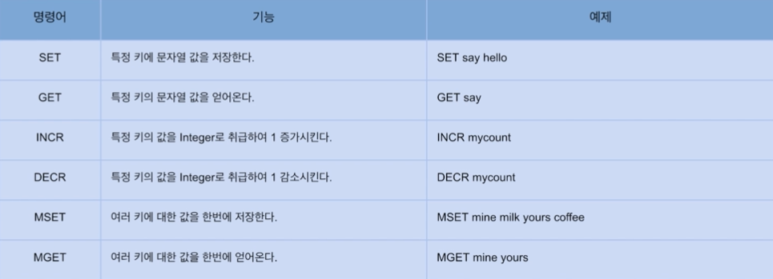

### Data Type 정리

#### String

- 가장 기본적인 데이터 타입으로 많이 사용됨
- 바이트 배열을 저장 (binary-safe)
- 바이너리로 변호나할 수 있는 모든 데이터를 저장 가능(JPG와 같은 파일 등)
- 최대 크기는 512MB

---

#### 주요 명령어

`INCR` 같은 경우에는 값이 Atomic 하게 저장되기 때문에 `Race Condition` 에 걸리지 않는다.