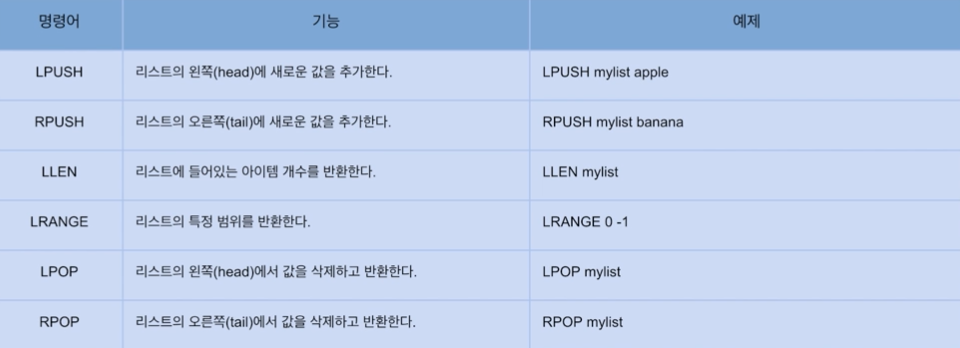

### Data Type 정리

#### String

- 가장 기본적인 데이터 타입으로 많이 사용됨
- 바이트 배열을 저장 (binary-safe)
- 바이너리로 변호나할 수 있는 모든 데이터를 저장 가능(JPG와 같은 파일 등)
- 최대 크기는 512MB

#### 주요 명령어


`INCR` 같은 경우에는 값이 Atomic 하게 저장되기 때문에 `Race Condition` 에 걸리지 않는다.

---

#### Lists

- Linked-list 형태의 자료구조(인덱스 접근은 느리지만 데이터 추가/삭제가 빠름)
- Queue와 Stack으로 사용할 수 있음

#### 주요 명령어



같은 방향에 값을 넣고 빼게되면 Stack 처럼 실행되고 반대 방향에서 빼게되면 Queue 처럼 실행된다.

```
lpush mylist apple
lpush mylist banana
```

위의 실행 명령어는 비어있는 최초의 list [] 왼쪽에 `apple` 이 들어가게되며 이때 [`apple`] 로 저장된다.
2번째로 banana 또한 왼쪽으로 넣게 되면 [`banana`, `apple`] 로 저장된다.

이후 빼는 순서가 왼쪽에서 빼게되면 Stack 처럼 값을 삭제 및 반환한다.

```
lpop mylist
```

첫 pop 은 왼쪽에서 실행되었고 이 때 맨 왼쪽에 있던 'banana'