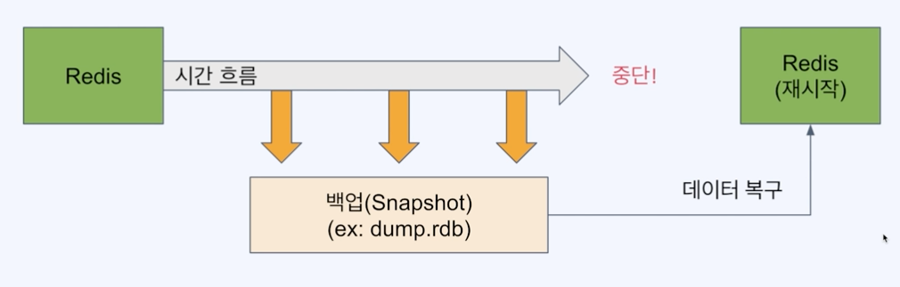
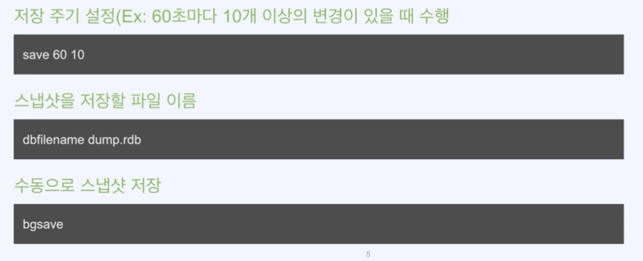
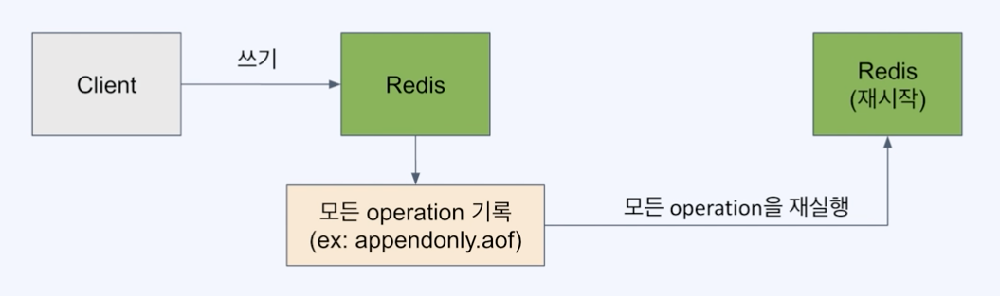
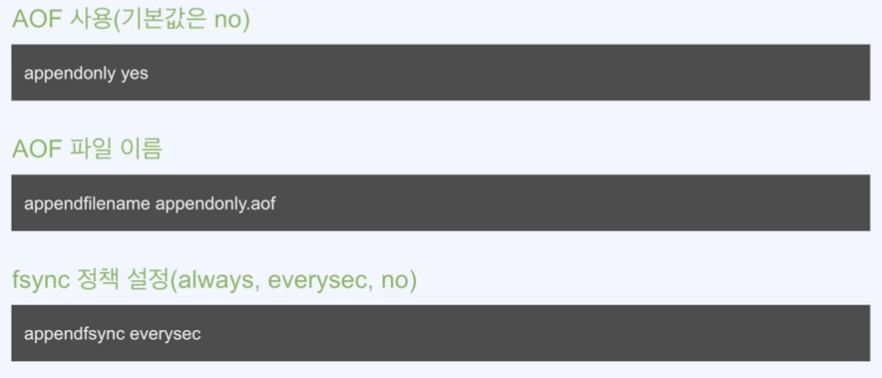
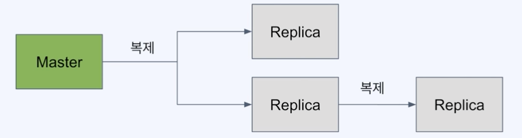
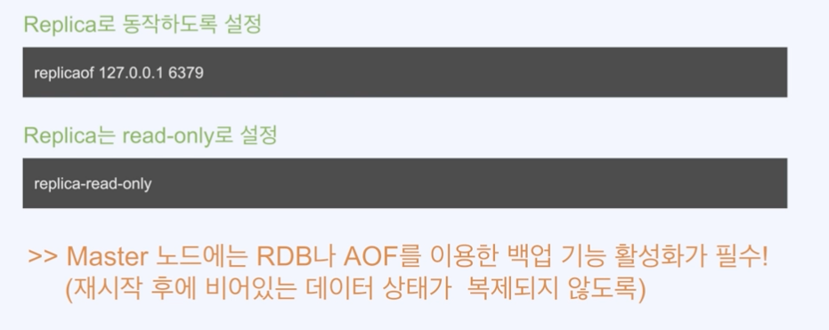
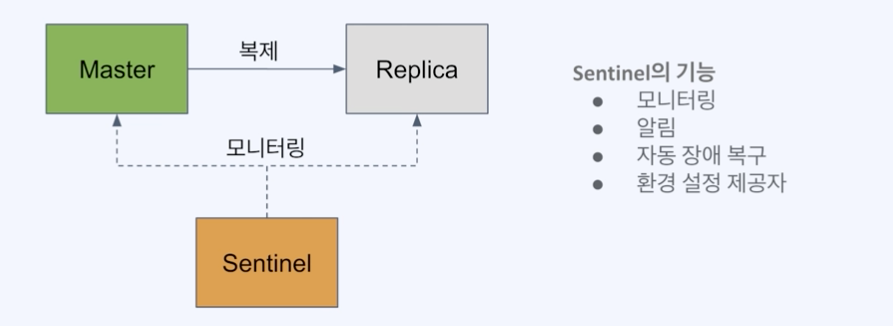
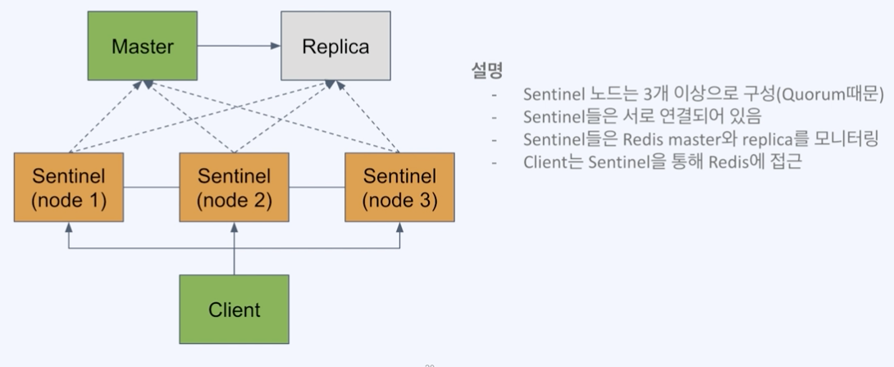

#### RDB (Redis Database)를 사용한 백업

- 특정 시점의 스냅샷으로 데이터 저장
- 재시작 시 RDB 파일이 있으면 읽어서 복구



#### 장점

- 작은 파일 사이즈로 백업 파일 관리가 용이(원격지 백업, 버전 관리 등)
- fork를 이용해 백업하므로 서비스 중인 프로세스는 성능에 영향 없음
- 데이터 스냅샷 방식이므로 빠른 복구가 가능

#### 단점

- 스냅샷을 저장하는 시점 사이의 데이터 변경사항은 유실될 수 있음
- fork를 이용하기 때문에 시간이 오래 걸릴 수 있고, CPU와 메모리 자원을 많이 소모
- 데이터 무결성이나 정합성에 대한 요구가 크지 않은 경우 사용 가능
  (마지막 백업 시 에러 발생 등의 문제)

---

#### RDB 설정

- 설정파일이 없어도 기본값으로 RDB 활성화되어 있음
- 설정 파일 만들려면 템플릿을 받아서 사용 (https://redis.io/docs/management/config/)



#### Docker를 사용해 Redis 설정 파일 적용하기

- docker run 사용 시 -v 옵션을 이용해 디렉토리 또는 파일을 마운팅할 수 있음
- redis 이미지 실행 시 redis-server에 직접 redis 설정파일 경로 지정 가능
```
docker run -v /my/redis.conf:/redis.conf --name my-redis redis redis-server /redis.conf
```

---

#### AOF (Append Only File)를 사용한 백업

- 모든 쓰기 요청에 대한 로그를 저장
- 재시작 시 AOF에 기록된 모든 동작을 재수행해서 데이터를 복구



#### AOF 사용의 장점

- 모든 변경사항이 기록되므로 RDB 방식 대비 안정적으로 데이터 백업 가능
- AOF 파일은 append-only 방식이므로 백업 파일이 손상될 위험이 적음
- 실제 수행된 명령어가 저장되어 있으므로 사람이 보고 이해할 수 있고 수정도 가능

#### AOF 사용의 단점

- RDB 방식보다 파일 사이즈가 커짐
- RDB 방식 대비 백업&복구 속도가 느림(백업 성능은 fsync 정책에 따라 조절 가능)

#### AOF 설정



#### fsync 정책(append fsync 설정 값)

- fsync() 호출은 OS에게 데이터를 디스크에 쓰도록 함
- 가능한 옵션과 설명
  - always: 새로운 커맨드가 추가될 때마다 수행. 가장 안전하지만 가장 느림.
  - everysec: 1초마다 수행. 성능은 RDB 수준에 근접. (가장 많이 사용)
  - no: OS에 맡김. 가장 빠르지만 덜 안전한 방법.(커널마다 수행 시간이 다를 수 있음)

#### AOF 관련 개념

- Log rewriting: 최종 상태를 만들기 위한 최소한의 로그만 남기기 위해 일부를 새로 씀
  (Ex: 1개의 key 값을 100번 수정해도 최종 상태는 1개이므로 SET 1개로 대체 가능)
- Multi Part AOF: Redis 7.0부터 AOF가 단일 파일에 저장되지 않고 여러 개가 사용됨
  - base file: 마지막 rewrite 시의 스냅샷을 저장
  - incremental file: 마지막으로 base file이 생성된 이후의 변경사항이 쌓임
  - manifest file: 파일들을 관리하기 위한 메타 데이터를 저장

---

#### Redis replication(복제)

- 백업만으로는 장애 대비에 부족함(백업 실패 가능성, 복구에 소요되는 시간)
- Redis도 복제를 통해 가용성을 확보하고 빠른 장애조치가 가능
- master가 죽었을 경우 replica 중 하나를 master로 전환해 즉시 서비스 정상화 가능
- 복제본(replica)은 read-only 노드로 사용 가능하므로 traffic 분산도 가능



#### Redis 복제 사용

- Replica 노드에서만 설정을 적용해 master-replica 복제 구성 가능
- master 에는 백업 기능을 꼭 활성화 해야한다



---

#### Replica 실습
```
version: "3"
services:
  my-redis-a:
    hostname: redis-master
    container_name: redis-master
    image: "bitnami/redis"
    environment:
      - REDIS_REPLICATION_MODE=master
      - ALLOW_EMPTY_PASSWORD=yes
    ports:
      - 6379:6379

  my-redis-b:
    hostname: redis-replicas-1
    container_name: redis-replicas-1
    image: "bitnami/redis"
    environment:
      - REDIS_REPLICATION_MODE=slave
      - REDIS_MASTER_HOST=redis-master
      - ALLOW_EMPTY_PASSWORD=yes
    ports:
      - 5000:6379
    depends_on:
      - my-redis-a
```

위의 내용으로 docker-compose 를 통해 빌드하고 난 후 각각의 컨테이너에 접속하여 master 에서 키를 set 하고
replica 쪽에서 get 했을 때 키가 복제되었는지 확인

---

#### Redis Sentinel

- Redis에서 HA(high availability)를 제공하기 위한 장치
- master-replica 구조에서 master가 다운 시 replica를 master로 승격시키는 auto-failover를 수행



#### Redis Sentinel 실제 구성도



#### Redis Sentinel 특징

- SDOWN(Subjective down)과 ODOWN(Objective down)의 2가지 판단이 있음
  - SDOWN: Sentinel 1대가 down으로 판단(주관적)
  - ODOWN: 정족수가 충족되어 down으로 판단(객관적)
- master 노드 down된걸로 판단되기 위해서는 Sentinel 노드들이 정족수(Quorum)을 충족해야 함
- 클라이언트는 Sentinel을 통해 master의 주소를 얻어내야 함

#### Sentinel 실습

```
version: "3"
services:
  my-redis-a:
    hostname: redis-master
    container_name: redis-master
    image: "bitnami/redis"
    environment:
      - REDIS_REPLICATION_MODE=master
      - ALLOW_EMPTY_PASSWORD=yes
    ports:
      - 5000:6379

  my-redis-b:
    hostname: redis-replicas-1
    container_name: redis-replicas-1
    image: "bitnami/redis"
    environment:
      - REDIS_REPLICATION_MODE=slave
      - REDIS_MASTER_HOST=redis-master
      - ALLOW_EMPTY_PASSWORD=yes
    ports:
      - 5001:6379
    depends_on:
      - my-redis-a

  redis-sentinel-1:
    container_name: sentinel1
    image: 'bitnami/redis-sentinel:latest'
    environment:
      - REDIS_SENTINEL_DOWN_AFTER_MILLISECONDS=3000
      - REDIS_MASTER_HOST=redis-master
      - REDIS_MASTER_PORT_NUMBER=6379
      - REDIS_MASTER_SET=mymaster
      - REDIS_SENTINEL_QUORUM=2
    ports:
      - 26379:26379
    depends_on:
      - my-redis-a
      - my-redis-b

  redis-sentinel-2:
    container_name: sentinel2
    image: 'bitnami/redis-sentinel:latest'
    environment:
      - REDIS_SENTINEL_DOWN_AFTER_MILLISECONDS=3000
      - REDIS_MASTER_HOST=redis-master
      - REDIS_MASTER_PORT_NUMBER=6379
      - REDIS_MASTER_SET=mymaster
      - REDIS_SENTINEL_QUORUM=2
    ports:
      - 26380:26379
    depends_on:
      - my-redis-a
      - my-redis-b

  redis-sentinel-3:
    container_name: sentinel3
    image: 'bitnami/redis-sentinel:latest'
    environment:
      - REDIS_SENTINEL_DOWN_AFTER_MILLISECONDS=3000
      - REDIS_MASTER_HOST=redis-master
      - REDIS_MASTER_PORT_NUMBER=6379
      - REDIS_MASTER_SET=mymaster
      - REDIS_SENTINEL_QUORUM=2
    ports:
      - 26381:26379
    depends_on:
      - my-redis-a
      - my-redis-b
```

위의 내용으로 docker-compose 를 통해 빌드하고 난 후 sentinel1 에 접속하여 `redis-cli -p 26379` 에 접근하고 `info sentinel` 을
입력하면 다음처럼 확인이 가능하다.
```
# Sentinel
sentinel_masters:1
sentinel_tilt:0
sentinel_tilt_since_seconds:-1
sentinel_running_scripts:0
sentinel_scripts_queue_length:0
sentinel_simulate_failure_flags:0
master0:name=mymaster,status=ok,address=172.22.0.2:6379,slaves=1,sentinels=3
```

`172.22.0.2` 해당 아이피는 가상 아이피라서 서로 다를 수 있고 현재 위에서의 아이피는 `redis-master` 컨테이너 ip이다.

`docker inspect redis-master` 로 확인하면 IpAddress 를 확인할 수 있다.

이 상태에서 `docker stop redis-master` 로 master 를 종료시키면 새로운 master 를 선출하고
센티넬에서는 ip가 변경됨을 확인이 가능하며 다시 `redis-master` 를 재가동 시키면 이미 master가 존재하기
때문에 slave 로 구동이되고 실제로 컨테이너에 접속하여 redis 에서 키를 set 하려고 하면 `readonly` 가 뜨는 것을 볼 수 있다