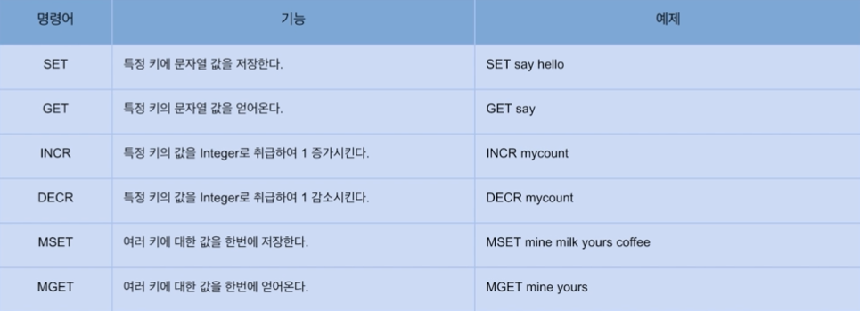
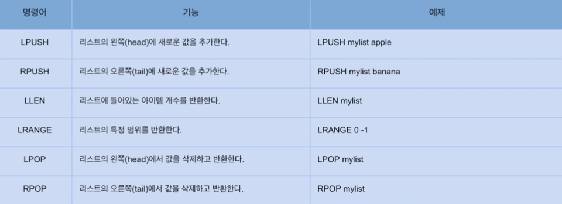
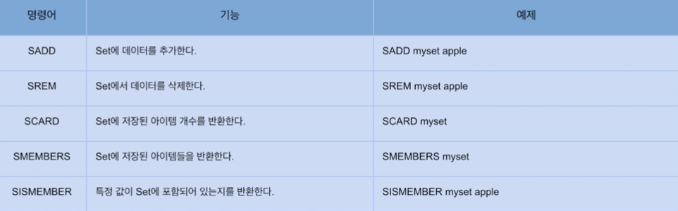
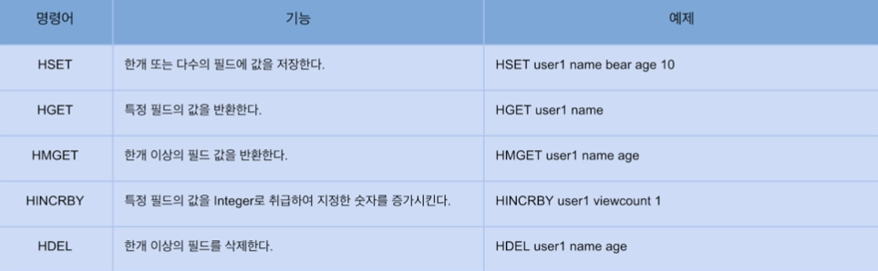
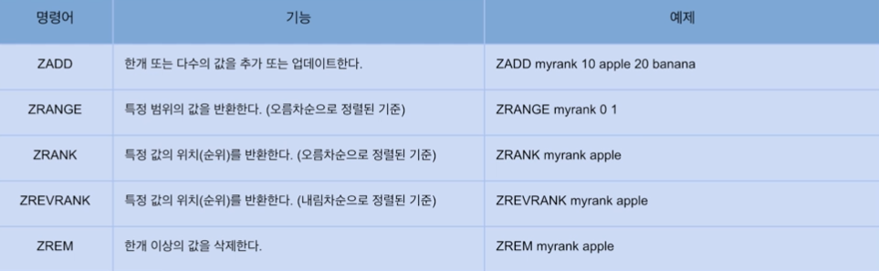
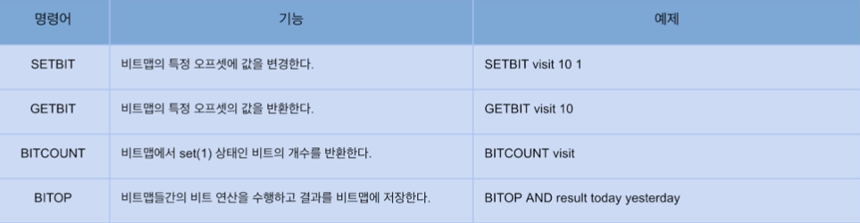
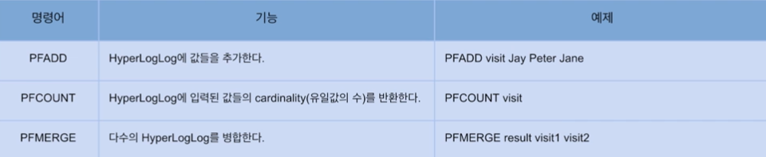

### Data Type 정리

#### String

- 가장 기본적인 데이터 타입으로 많이 사용됨
- 바이트 배열을 저장 (binary-safe)
- 바이너리로 변호나할 수 있는 모든 데이터를 저장 가능(JPG와 같은 파일 등)
- 최대 크기는 512MB

#### 주요 명령어



`INCR` 같은 경우에는 값이 Atomic 하게 저장되기 때문에 `Race Condition` 에 걸리지 않는다.

---

#### Lists

- Linked-list 형태의 자료구조(인덱스 접근은 느리지만 데이터 추가/삭제가 빠름)
- Queue와 Stack으로 사용할 수 있음

#### 주요 명령어



같은 방향에 값을 넣고 빼게되면 Stack 처럼 실행되고 반대 방향에서 빼게되면 Queue 처럼 실행된다.

```
lpush mylist apple
lpush mylist banana
```

위의 실행 명령어는 비어있는 최초의 list [] 왼쪽에 `apple` 이 들어가게되며 이때 [`apple`] 로 저장된다.
2번째로 banana 또한 왼쪽으로 넣게 되면 [`banana`, `apple`] 로 저장된다.

이후 빼는 순서가 왼쪽에서 빼게되면 Stack 처럼 값을 반환 및 삭제된다.

```
lpop mylist
```

첫 pop 은 왼쪽에서 실행되었고 이 때 맨 왼쪽에 있던 `banana` 가 반환 및 삭제된다.
만약 2개의 값이 처음에 넣을 때와 같은 순서대로 들어 가있었고 `rpop mylist` 을 실행한다면
맨 처음에 넣었던 값 `apple` 먼저 나오기 때문에 Queue 처럼 진행된다.

---

#### Sets

- 순서가 없는 유니크한 값의 집합
- 검색이 빠름
- 개별 접근을 위한 인덱스가 존재하지 않고, 집합 연산이 가능(교집합, 합집합 등)

#### 주요 명령어



> 웹 페이지에서 특정 시간 내에 사용이 가능한 쿠폰을 발급할 때 사용자는 딱 한번만 발급받을 수 있을 때 검증하기 위해 Set 에 사용자 정보를 넣어두면
빠르게 확인이 가능하다.

---

#### Hashes

- 하나의 key 하위에 여러개의 field-value 쌍을 저장
- 여러 필드를 가진 객체를 저장하는 것으로 생각할 수 있음
- HINCRBY 명령어를 사용해 카운터로 활용 가능 (클릭수, 방문수 등)

#### 주요 명령어



`HINCRBY` 는 String 명령어 `INCR` 과 다르게 지정된 숫자를 증가 시킬 수 있다.

---

#### SortedSets

- Set과 유사하게 유니크한 값의 집합
- 각 값은 연관된 score를 가지고 정렬되어 있음
- 정렬된 상태이기에 빠르게 최소/최대값을 구할 수 있음
- 순위 계산, 리더보드 구현 등에 활용

#### 주요 명령어




`ZRANGE`, `ZRANK` 는 기본적으로 오름차순 정렬이 적용된다.
내림차순으로 정렬 하려면 사이에 `ZREVRANGE`, `ZREVRANK` 처럼 `*REV*` 추가해야한다.

---

#### Bitmaps

- 비트 벡터를 사용해 N개의 Set을 공간 효율적으로 저장
- 하나의 비트맵이 가지는 공간은 4,294,967,295(2^32-1)
- 비트 연산 가능 

#### 주요 명령어



`GETBIT` 로 아직 지정되지 않은 offset 을 조회하면 기본 값은 `0` 이다.

---

#### HyperLogLog

- 유니크한 값의 개수를 효율적으로 얻을 수 있음
- 확률적 자료구조로서 오차가 있으며, 매우 큰 데이터를 다룰 때 사용
- 18,446,744,073,709,551,616(2^64)개의 유니크 값을 계산 가능
- 12KB까지 메모리를 사용하며 0.81%의 오차율을 허용

#### 주요 명령어

 