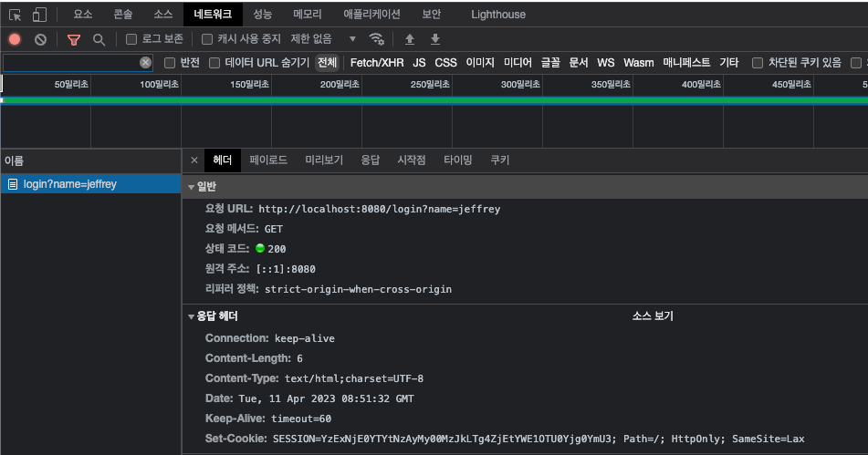
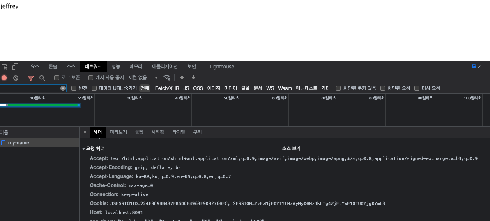

#### Redis 로 session 관리하기

Spring Boot 에서의 session 관리를 하기 위해서는 HttpSession 에서 값을 할당하고 조회하는 방식으로 가능하다.
하지만 분산 환경에서 HttpSession 만으로 값을 저장하고 조회하는 것은 어렵다. 만약 DB 를 사용해서 session 값을 관리한다면 상관없지만
짧게 사용하는 값인 만큼 DB를 사용할 정도는 아니기 때문에 비효율적이다. 따라서 이를 Redis 에서 구현하면 다음과 같다.

먼저 다음 처럼 의존성을 추가한다.

```
dependencies {
    implementation 'org.springframework.boot:spring-boot-starter-data-redis'
    implementation 'org.springframework.session:spring-session-data-redis'
    implementation 'org.springframework.boot:spring-boot-starter-web'
    testImplementation 'org.springframework.boot:spring-boot-starter-test'
}
```

`starter-data-redis` 와 `session-data-redis` 2개가 꼭 필요하다.

그리고 yml 에서 다음과 같이 저장소와 연결하려는 Redis 의 접속 정보를 기입한다.

```
spring:
  session:
    storage-type: redis
  data:
    redis:
      host: localhost
      port: 6379
```

---

간단한 예제를 통해 알아보자.

```
@RestController
public class LoginController {

    @GetMapping("/login")
    public String login(HttpSession session, @RequestParam String name) {
        session.setAttribute("name", name);
        return "saved.";
    }

    @GetMapping("/my-name")
    public String myName(HttpSession session) {
        return (String) session.getAttribute("name");
    }

}
```

위와 같은 로그인 API 를 하나 만들어서 build 후 war 파일을 서로 다른 포트를 사용하여 실행시킨다.

```
java -Dserver.port=8080 -jar redis.war
java -Dserver.port=8081 -jar redis.war
```

그런 다음 API 통신을 다음과 같이 실행한다.
```
http://localhost:8080/login?name=jeffrey
```


이미지에서 볼 수 있듯이 응답헤더에 `JSESSION` 이라는 값이 아닌 `SESSION` 이라는 값으로 할당되어 받은 것을 볼 수 있다.

---

값을 얻어오는 API 를 요청하면
```
http://localhost:8081/my-name
```


요청헤더에 이전에 저장한 `SESSION` 값을 그대로 요청하며 분산환경에서도 같은 값을 조회하는 것을 볼 수 있다.